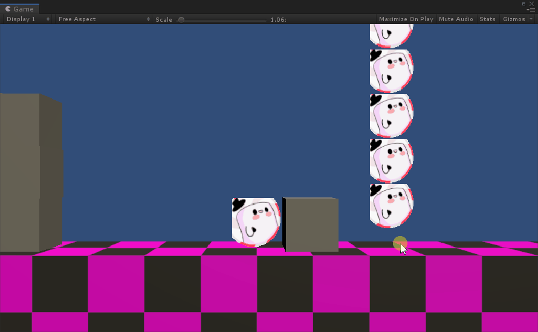

Check it out on [itch.io](https://mellowmares.itch.io/mellowmares).

### note: Going to move this wall of text to the essays section, as it kind of turned into a postmortem

The Major Production Project starts with game pitches. Where students from all three streams had a chance to pitch ideas to the teachers, students and a panel of industry veterans (folks from GamesPlus). After the first round we each joined two projects of our choice to work on our pitches to the industry. After two weeks of highly confused prototyping and one day of presenting to the industry panel, we had our major projects.

When discussing a good example from the previous year the teachers pointed out the importance of having gameplay as a proof-of-concept, so naturally we all left the presentations to the last minute and focused on the prototypes. I did some nice work for the other one, which never made it into the prototype. For MellowMares my focus was on the traps and health system (only two survived the switch to unreal, health system was scrapped).

Following the prototyping we were able to work on a single game, mellowMares in my case.
We would take the lessons learnt from the prototyping phase, organize and plan out our game, get the new team members up to speed, make a schedule, update our design docs, then begin making the game.

Of couse, we didn't do any of those things. The lead programmer didn't even make a Technical Document. It took about 3 weeks for me to realise that *I* was the lead programmer. Our other programmer had a lot of scheduling issues. We perhaps should have cut or simplified some features, but instead I tried to make the player character exactly as the design doc described it, even though a few simple tweaks would have made the whole thing a lot more manageable.

Eventually, the Unity Project was coming together, but progress was still slow, Unity was a very code-heavy engine and I was the only full-time person who knew how to code. I'm not the fastest at it either, I tend to refactor and experiment a lot.
Meanwhile none of the 3 artists had experience in Unity, the designers were hacking animations togther in-engine, and the UI was done by me in MS-Paint.
So the teachers proposed a bold plan: grab the assets, move to Unreal Engine 4, and start anew.
I would lose a lot of the work I had done for the past 2 months, have to learn a new engine, and essentially would have 9 weeks to develop a game by the seat of my pants.

It seemed like a good idea at the time, I swear.

