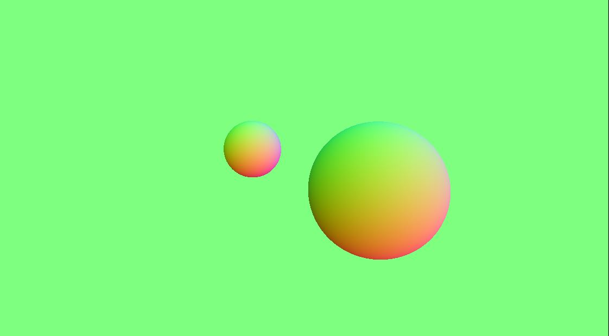
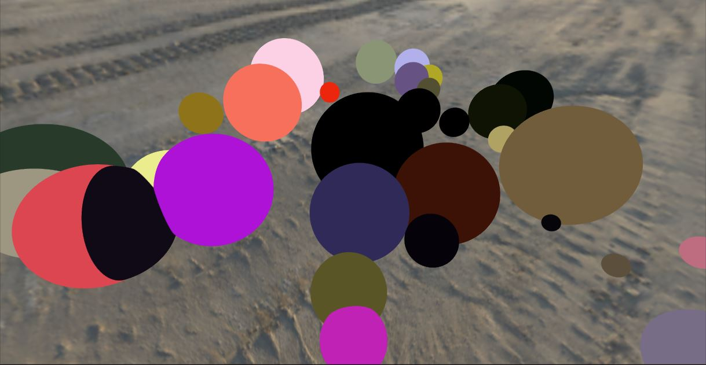
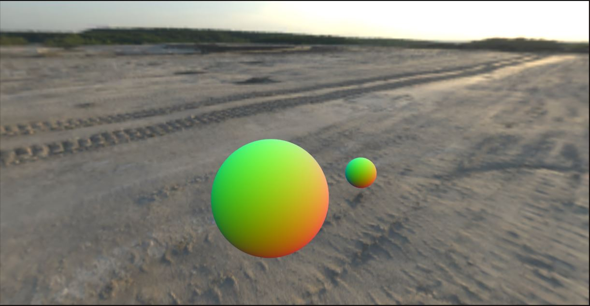
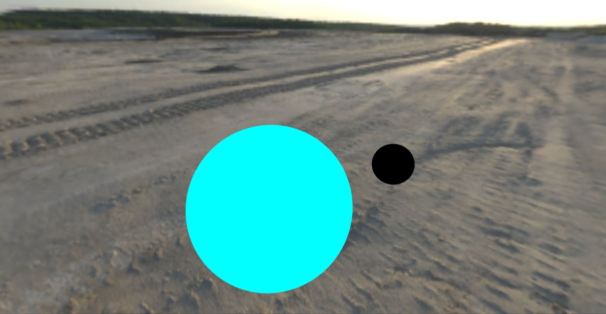
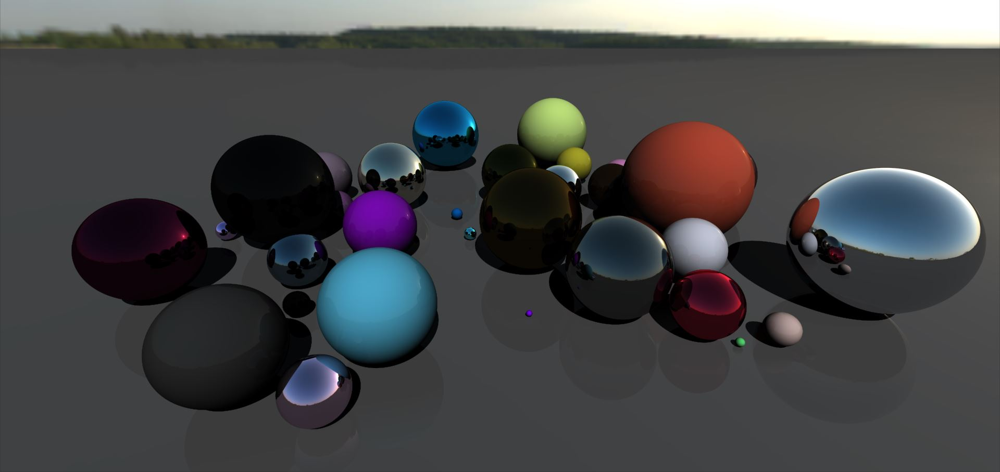
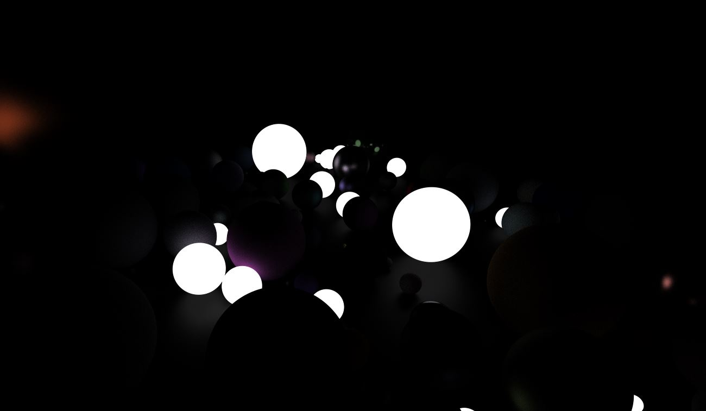

  
  
  
  
  
  
  
  

This is a project I made to learn compute shaders and rendering in Unity.

source code is on github, maybe, I don't know I'm very tired and unprofessional right now.
Good thing I'm not showing this to anyone eh?

 