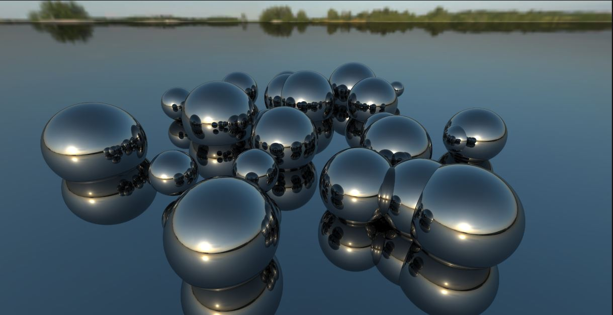

This is a project I made to learn compute shaders and rendering in Unity.

source code is on github, maybe, I don't know I'm very tired and unprofessional right now.

Getting the normals.

Adding colors and a Skybox.

Spheres with random colors and positions.

lighting and reflection

Specular light and color.

Emissive materials in a dark scene.

The Final Product.

also there are polygons but I don't have screenshot of them.
