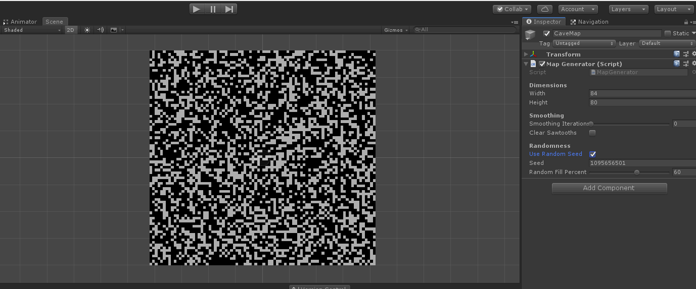

A map generator I made.

It works by randomly filling the map by a certain percentage (around 60% seems to work best), then using a cellular automata rule to smooth out the noise into a pretty decent representation of a cave system. using a final pass with a slightly different rule to smooth out some jagged edges caused by my implentation.

Unfortunately this rule tends to produce the best results at lower resolutions, something that could potentially be *fixed/helped/supplemented/whatever* by generating at a lower resolution then upscaling before the last few passes.

One thing I'm quite happy with is the ability to update the map in real time, it makes it very to test things. although once I implemented Unity's tilemap system I had to jump through some hoops to avoid the problems with changing files in the editor.

It's also not entirely clear whether black or white tiles are supposed to be the walls/caves, since the algorithm doesn't them differently.

I've also managed to get this hooked up to Unity's tilemaps and have a player character jumping around. Funnily enough, this hasn't made the black white difference any clearer: I've currently got enemies and physics objects running around inside walls as if they were caves.

I feel vaguely as though I've accidently made a minimalist puzzle platformer.
